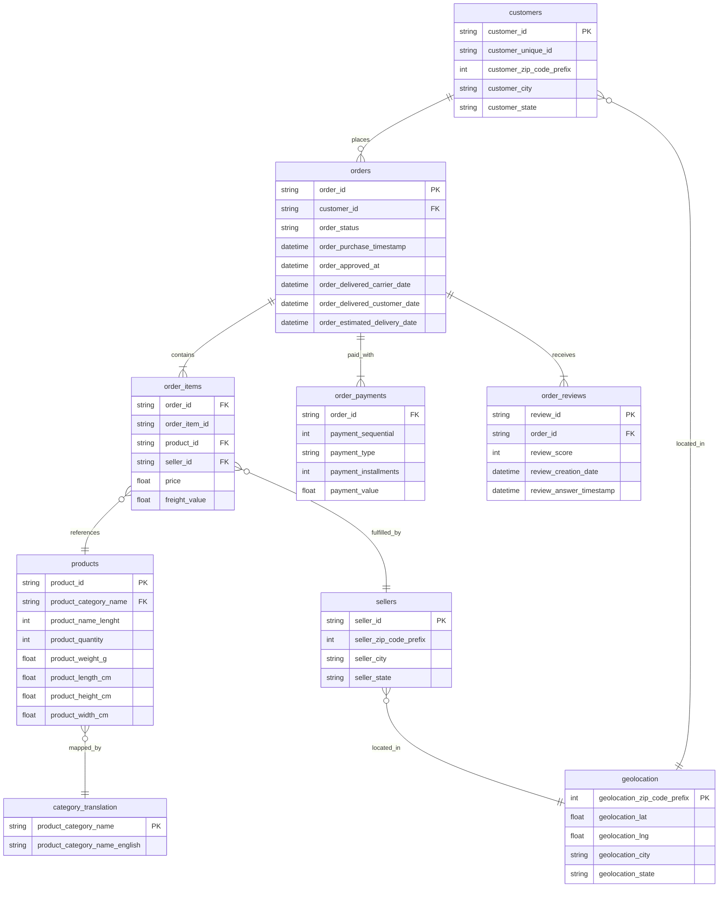
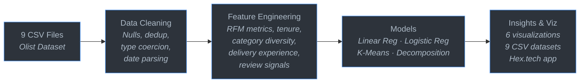

# E-Commerce Analytics BI: Brazilian Marketplace Customer Insights

> **End-to-end customer analytics on 96K+ orders from Olist's Brazilian marketplace.** Predicting lifetime value, flagging churn risk, segmenting customers, and forecasting revenue. Built with NumPy, pandas, and matplotlib. Published as an interactive Hex.tech app.

<p align="center">
  
  
  
  <a href="https://app.hex.tech/019eb393-3d2c-75b8-9208-12e174506253/app/Anlise-Estatstica-033WEl77K3vpzktpaYP4Ct/latest"></a>
</p>

---

## Executive Summary

Olist is the largest marketplace platform in Brazil. This project treats their public dataset as a real business intelligence engagement: a CX team needs to understand what drives customer value, who is at risk of leaving, and where revenue is headed.

The numbers tell a clear story.

- **96,477 orders** from **93,357 unique customers** generating **R$15.4M** in revenue between 2016 and 2018.
- Only **3.0% of customers return** for a second purchase. The repeat rate is brutal.
- Nearly **60% of customers show churn signals** (no purchase in the final 6 months of the dataset).
- Yet the **top segment (Loyal High-Value) accounts for 62.6% of all revenue** despite being a small fraction of the customer base.

Four models were built to answer four business questions:

| Question | Approach | Result |
|----------|----------|--------|
| What drives customer lifetime value? | Linear regression (5 behavioral features) | **R² = 0.989** |
| Which customers are at risk of churning? | Logistic regression (triage tool) | **AUC = 0.636, F1 = 0.73** |
| How should we segment for retention? | K-Means on RFM metrics | **4 segments, Loyal HV = 62.6% of revenue** |
| What revenue can we expect next year? | Additive trend + seasonality decomposition | **BRL 18.6M (+56.2%)** |

All models were implemented from scratch using NumPy. No scikit-learn, no Prophet, no black boxes. Every coefficient, every cluster centroid, every forecast component is transparent and auditable.

---

## Business Problem

A marketplace operations team walks into a quarterly review with four questions their VP wants answered:

1. **What drives customer lifetime value?** Which behaviors predict a high-value customer, and can we estimate CLV early enough to act on it?
2. **Who is at risk of churning?** Can we flag at-risk customers before they leave, and what early warning signals exist in the order data?
3. **How should we segment customers?** A one-size-fits-all retention strategy wastes budget. Which groups deserve investment, and which are already lost?
4. **Where is revenue heading?** Given current trends and seasonal patterns, what should the business expect over the next 12 months?

These are not academic exercises. Each question maps to a concrete business decision: where to allocate marketing spend, when to trigger re-engagement campaigns, and how to set revenue targets for the next fiscal year.

---

## Dataset

**Source:** [Olist Brazilian E-Commerce Public Dataset](https://www.kaggle.com/datasets/olistbr/brazilian-ecommerce) (Kaggle, CC BY-NC-SA 4.0)

**Scope:** 96,477 orders | 93,357 customers | R$15.4M revenue | 2016 to 2018

**Schema:** 9 relational tables spanning orders, items, payments, reviews, products, sellers, and geolocation data.



---

## Key Findings

### 1. Customer Lifetime Value (R² = 0.989)

A linear regression model predicts total customer revenue from five behavioral features: order frequency, average ticket size, customer tenure, payment behavior, and review signals.

The R² of 0.989 means the model captures nearly all the variance in customer spending. The dominant predictors are intuitive but worth confirming with data: customers who order more often, spend more per order, and stay longer on the platform generate disproportionately higher lifetime value. Payment installment usage and review engagement add incremental predictive power beyond the obvious features.

The practical takeaway: you don't need complex deep learning to estimate CLV in a marketplace context. Five well-chosen behavioral features, fit with a transparent linear model, explain almost all the variation. Every coefficient is interpretable. Every prediction is auditable.

### 2. Churn Risk Triage (AUC = 0.636, F1 = 0.73)

Let's be honest about what this model is and what it isn't.

The logistic regression classifier achieves an AUC of 0.636. That's modest. It won't win Kaggle competitions. But it was never designed to be a precise churn predictor. It's a **triage tool**: a fast, lightweight way to rank customers by churn risk so a CX team can prioritize outreach.

With an F1 of 0.73, the model catches a meaningful share of at-risk customers without generating so many false positives that the outreach team drowns in noise. The top risk signals are recency (days since last purchase), delivery experience (shipping delays correlate with churn), and satisfaction indicators (low review scores, complaint patterns).

Think of it as a sorting hat, not a crystal ball. It puts customers into rough risk buckets so humans can make the final call on who gets a retention offer and who doesn't.

### 3. RFM Segmentation

K-Means clustering on Recency, Frequency, and Monetary metrics identifies four distinct customer groups:

| Segment | Share of Revenue | Profile | Strategic Implication |
|---------|-----------------|---------|----------------------|
| **Loyal High-Value** | **62.6%** of R$15.4M | Frequent buyers, high spend, long tenure | Protect at all costs. VIP treatment, early access, loyalty rewards. |
| **Potential Loyalists** | **18.4%** | Moderate frequency, growing spend, recent activity | Nurture with targeted upsell. They're on the fence between growth and churn. |
| **At-Risk** | **13.3%** | Declining frequency, increasing recency, lower spend | Intervene now. Re-engagement campaigns, discount offers, satisfaction surveys. |
| **Champions** | **5.6%** | Highest per-order value, low frequency but high ticket | Maintain relationship. Premium support, category expansion, referral programs. |

The concentration is striking: Loyal High-Value customers generate nearly two-thirds of all revenue from a relatively small customer base. Losing even a fraction of this segment would have an outsized impact on the bottom line. The 3.0% repeat purchase rate across the full customer base underscores how critical retention of this group is.

### 4. Revenue Forecast (BRL 18.6M, +56.2%)

A 12-month forward projection using additive decomposition (trend + monthly seasonality) estimates total revenue at BRL 18.6M, a 56.2% increase over the observed period.

The time series shows clear seasonal patterns: revenue peaks around mid-year and in Q4 (Black Friday, holiday season), with troughs in Q1. The underlying trend is upward, consistent with a growing marketplace.

Caveats matter here. This forecast assumes the marketplace continues operating under similar conditions. It doesn't account for new market entrants, macroeconomic shocks, or platform-level changes (new categories, seller onboarding spikes). Treat it as a baseline, not a guarantee.

---

## Methodology



### Data Cleaning

All 9 CSV files were loaded and unified into a single analytical dataset. The cleaning pipeline handles missing values (imputation for review scores, dropping rows with critical nulls), deduplication, type coercion (monetary values to float, timestamps to datetime), and date parsing across Brazilian timezone offsets.

### Feature Engineering

From the unified dataset, customer-level features were derived:

- **RFM metrics**: recency (days since last purchase), frequency (total orders), monetary (total revenue)
- **Tenure**: days since first purchase
- **Category diversity**: number of distinct product categories purchased
- **Delivery experience**: average shipping time, delivery delay ratio
- **Review signals**: average review score, complaint rate (reviews scoring below 3)
- **Payment behavior**: payment method diversity, installment usage ratio
- **Geolocation**: customer and seller state, distance proxies

### Modeling Approach

Every model in this project was built from scratch using NumPy. This wasn't a limitation of ambition. It was a constraint of the Hex.tech cloud environment, where scikit-learn, statsmodels, and Prophet were unavailable. The constraint turned into a strength: every algorithm is transparent, every intermediate calculation is inspectable, and there are zero black boxes.

| Model | Implementation | What it does |
|-------|---------------|--------------|
| **CLV Prediction** | Linear regression (NumPy, closed-form solution) | Predicts total customer revenue from 5 behavioral features |
| **Churn Triage** | Logistic regression (NumPy, gradient descent) | Ranks customers by churn probability for prioritized outreach |
| **RFM Segmentation** | K-Means clustering (NumPy, iterative Lloyd's algorithm) | Groups customers into 4 behavioral segments |
| **Revenue Forecast** | Additive decomposition (NumPy, trend + seasonality) | Projects 12-month revenue from historical monthly totals |

The original methodology spec (designed for scikit-learn and Prophet) is preserved in [`hex_export/hex-ai-prompt.md`](hex_export/hex-ai-prompt.md) for reference.

---

## Business Recommendations

Based on the analysis, four actions deserve priority:

1. **Protect the Loyal High-Value segment.** These customers generate 62.6% of revenue. Build a VIP retention program: dedicated support channels, early access to new categories, loyalty points with meaningful redemption options. The cost of losing one Loyal HV customer dwarfs the cost of the program.

2. **Deploy churn triage for proactive outreach.** The logistic model isn't precise enough for automated actions, but it's good enough to flag a shortlist for human review. A CX agent reviewing the top 500 at-risk customers weekly, with a personalized re-engagement offer, would cost a fraction of the revenue at stake.

3. **Attack the 3.0% repeat rate.** The fact that 97% of customers never return is the single biggest lever in this dataset. Before investing in complex retention, fix the basics: post-purchase follow-up emails, first-order discount codes for repeat purchases, and a frictionless re-order experience. Even a 1 percentage point improvement in repeat rate would meaningfully shift revenue.

4. **Plan capacity around seasonal peaks.** The forecast shows clear seasonality (mid-year and Q4 peaks). Marketing budgets, seller onboarding, and logistics capacity should scale ahead of these windows. The additive model provides a baseline. Update it quarterly with actuals as the marketplace grows.

---

## Tech Stack

**Python** · **NumPy** · **pandas** · **matplotlib** · **tabulate** · **Hex.tech** · **PostgreSQL** · **dbt** · **Metabase**

All statistical models implemented from scratch with NumPy. No scikit-learn, no Prophet, no black-box dependencies.

The data pipeline layer uses **PostgreSQL 16** for storage, **dbt** for SQL transformations (staging views + mart tables), and **Metabase** for self-service BI dashboards (see "BI Dashboards" below).

---

## BI Dashboards

The same Olist data was also used to build a self-service BI layer: 4 interactive Metabase dashboards backed by 70+ native SQL questions. Screenshots of each dashboard are in [`dashboards/`](./dashboards); the underlying SQL is in [`sql/`](./sql).

| Dashboard | Cards | Focus | Screenshot |
|-----------|-------|-------|------------|
| **E-commerce Insights** (3 tabs) | 36 | Revenue by state, products, categories, sources, checkout funnel | [Overview](./dashboards/01a_e-commerce_overview.png) · [Portfolio](./dashboards/01b_e-commerce_portfolio.png) · [Website](./dashboards/01c_e-commerce_website.png) |
| **Executive Dashboard** | 8 | KPIs (revenue, orders, AOV), trends, top categories, payment mix | [02_executive_dashboard.png](./dashboards/02_executive_dashboard.png) |
| **Customer Analytics** | 8 | RFM segmentation, CLV distribution, cohort retention, repeat rate | [03_customer_analytics_dashboard.png](./dashboards/03_customer_analytics_dashboard.png) |
| **Operations** | 8 | Fulfillment funnel, delivery time, on-time rate, review scores | [04_operations_dashboard.png](./dashboards/04_operations_dashboard.png) |

### Data pipeline (dbt)

The BI layer reads from a SQL-first pipeline: raw CSVs → PostgreSQL `olist_raw` schema → dbt staging views → dbt mart tables → Metabase. The dbt staging view SQL and the mart table DDL are in [`dbt-models/`](./dbt-models). The raw schema DDL is in [`bi-pipeline/postgres/`](./bi-pipeline/postgres).

```
Kaggle Olist CSVs (9 files)
        |
        v
PostgreSQL `olist` database
   |-- olist_raw schema (9 source tables, ~100K rows)
   |
   |-- olist_marts schema (dbt models)
       |-- staging views: stg_orders, stg_customers, stg_order_items
       |-- mart tables: mart_customer_orders, mart_monthly_revenue
        |
        v
Metabase 4 Dashboards / 70+ Questions
```

**Key row counts** (live snapshot from `pg_database`):

| Table | Rows |
|-------|------|
| `olist_raw.olist_orders` | 99,441 |
| `olist_raw.olist_customers` | 99,441 |
| `olist_raw.olist_order_items` | 112,650 |
| `olist_marts.mart_customer_orders` | 99,441 |
| `olist_marts.mart_monthly_revenue` | 23 |

### SQL examples

The dashboards run pure native SQL (no GUI query builder). A few highlights:

- **Customer RFM segmentation** ([`sql/customer_analytics_dashboard/01_customer_segments__rfm_.sql`](./sql/customer_analytics_dashboard/01_customer_segments__rfm_.sql)) — percentile-based Recency/Frequency/Monetary scoring that replicates the K-Means RFM in `analysis/olist_cx_analytics.py` using SQL only
- **Order fulfillment funnel** ([`sql/operations_dashboard/02_ops_q1__order_fulfillment_funnel.sql`](./sql/operations_dashboard/02_ops_q1__order_fulfillment_funnel.sql)) — counts orders by lifecycle stage
- **Total revenue** ([`sql/executive_dashboard/03_01_total_revenue.sql`](./sql/executive_dashboard/03_01_total_revenue.sql)) — KPI card reading from `olist_marts.mart_monthly_revenue`

### Recovery note

The BI layer was originally deployed via Docker Compose but the project directory was lost. The data and dashboard definitions survived in a Docker named volume (`docker_pgdata`). The full recovery writeup — including the Metabase v0.62.1.4 password reset and the `auth_identity.credentials` discovery — is in [`docs_RECOVERY.md`](./docs_RECOVERY.md).

---

## Reproducibility

```bash
# 1. Clone the repository
git clone https://github.com/Nicolas-Formenton/ecommerce-analytics-BI.git
cd ecommerce-analytics-BI

# 2. Install dependencies
pip install -r requirements.txt

# 3. Download the Olist dataset (requires Kaggle API key)
bash scripts/fetch_olist_data.sh
# Or download manually: https://www.kaggle.com/datasets/olistbr/brazilian-ecommerce

# 4. Run the analysis
python analysis/olist_cx_analytics.py

# 5. (Optional) Generate the PDF report
python analysis/generate_report.py
```

**Prerequisites:** Python 3.9+, Kaggle API credentials (for automated data download).

---

## Project Structure

```
ecommerce-analytics-BI/
├── analysis/         ← Standalone Python scripts (extracted from Hex)
├── data/             ← Data dictionary + download instructions
│   ├── raw/          ← Original Olist CSV files (after download)
│   └── processed/    ← Cleaned and feature-engineered datasets
├── hex_export/       ← Original Hex YAML project + AI prompt
├── reports/          ← Output reports (PDF, figures)
├── scripts/          ← Data download utilities
├── dashboards/       ← BI dashboard screenshots (Metabase) — 6 files for 4 dashboards
│                        (E-commerce Insights has 3 tabs: a=Overview, b=Portfolio, c=Website)
├── sql/              ← All 70+ native SQL queries, grouped by dashboard
├── dbt-models/       ← dbt staging view SQL + mart table DDL
├── bi-pipeline/      ← BI pipeline infrastructure files (Postgres schema DDL)
├── bi-screenshot.cjs ← Playwright script for re-capturing the dashboard screenshots
├── docs_RECOVERY.md  ← Metabase recovery writeup
├── requirements.txt  ← Python dependencies
├── DATA_LICENSE.md   ← CC BY-NC-SA 4.0 (for Olist dataset)
└── LICENSE           ← MIT (for code)
```

---

## Related Links

- **[Interactive Hex.tech App](https://app.hex.tech/019eb393-3d2c-75b8-9208-12e174506253/app/Anlise-Estatstica-033WEl77K3vpzktpaYP4Ct/latest):** Explore the full analysis with 9 chapters, interactive visualizations, and generated datasets.
- **[PDF Report](reports/hex-analise-estatistica-report.pdf):** Single-page executive summary with key charts (dark mode).

---

## License

This project uses dual licensing:

- **Code** (scripts, analysis, utilities): [MIT License](LICENSE)
- **Data** (Olist Brazilian E-Commerce dataset): [CC BY-NC-SA 4.0](DATA_LICENSE.md)

**Attribution:** Dataset provided by [Olist](https://www.kaggle.com/datasets/olistbr/brazilian-ecommerce) via Kaggle.

See [data/README.md](data/README.md) for full data licensing details.

---

## Acknowledgments

- Originally built in **Hex.tech** as "Análise Estatística", a 9-chapter interactive analytics app
- Dataset courtesy of [Olist](https://www.olist.com) and [Kaggle](https://www.kaggle.com)
- Methodology inspired by the original 5-phase project spec ([hex_export/hex-ai-prompt.md](hex_export/hex-ai-prompt.md))
